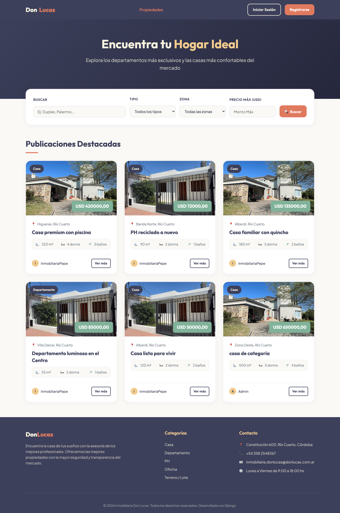
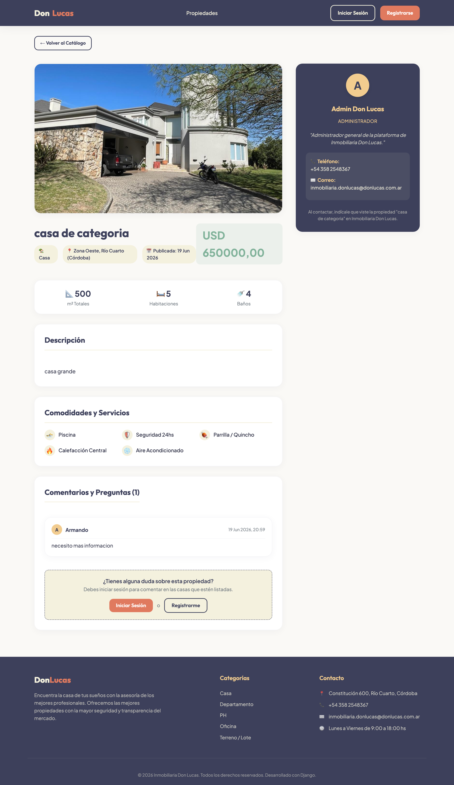
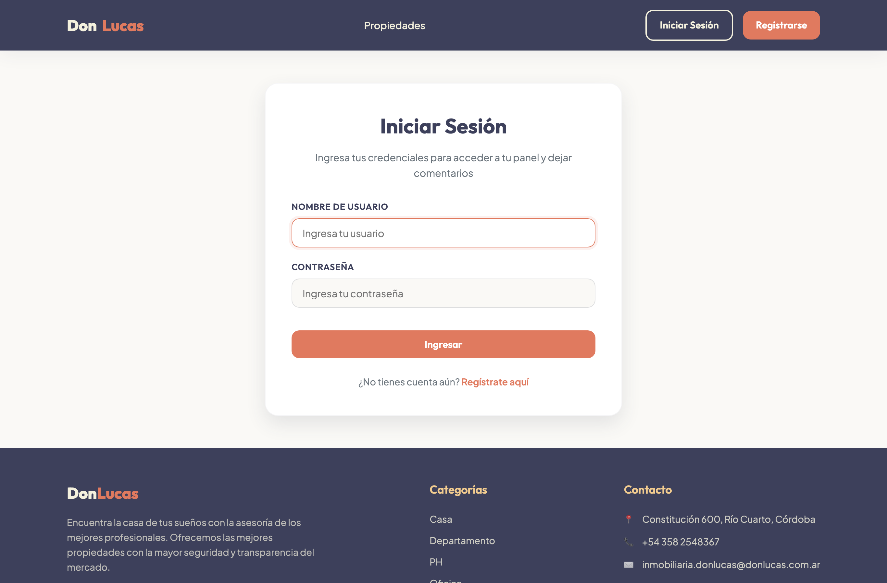
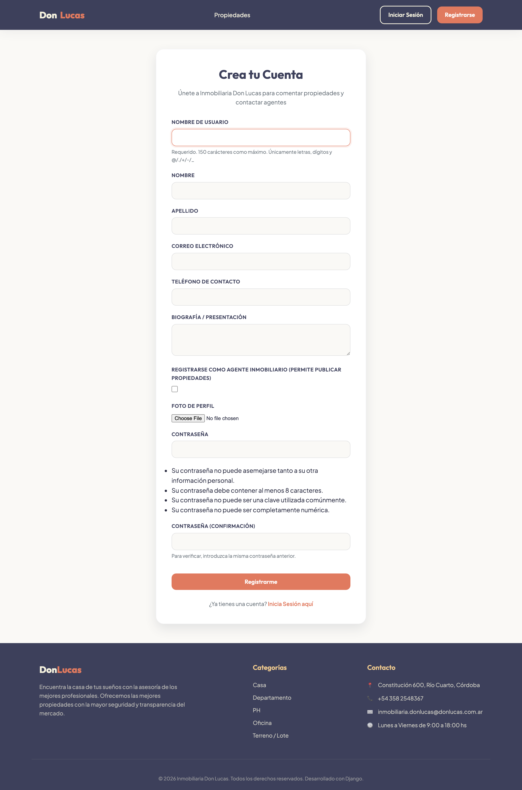
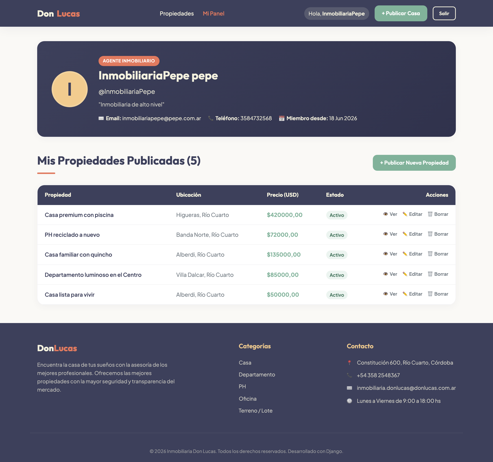
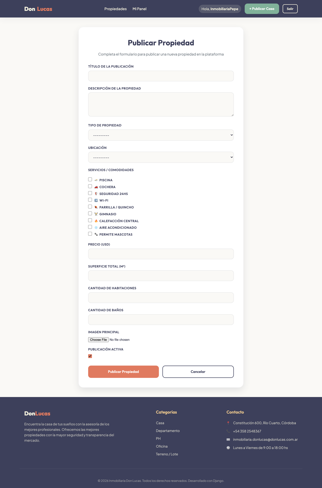
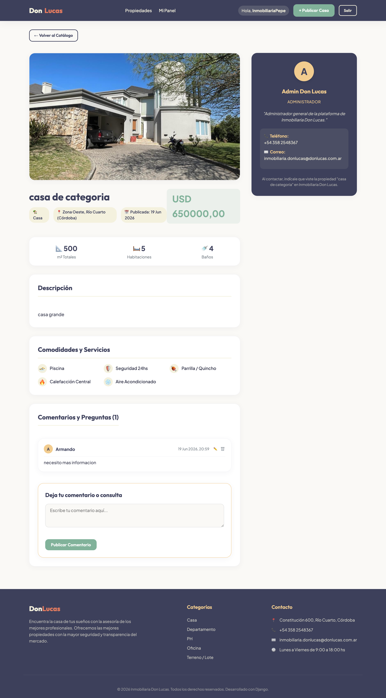
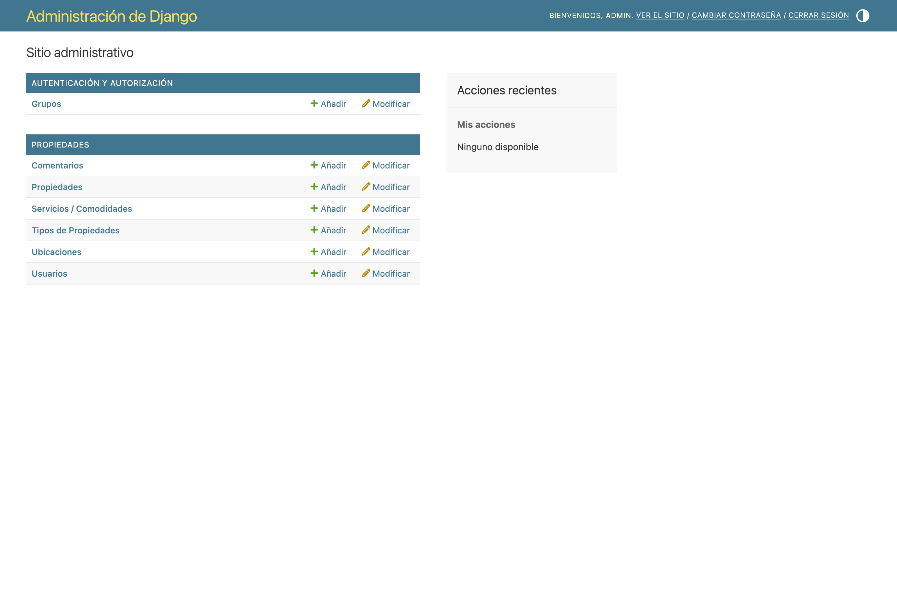

# 🏠 Inmobiliaria Don Lucas

Aplicación web de gestión inmobiliaria desarrollada con **Django**. Permite publicar, buscar y comentar propiedades, con un sistema de **roles y permisos** que diferencia a los agentes inmobiliarios de los clientes.

> Trabajo Práctico Evaluativo — **Ingeniería de Software**.

---

## 📋 Tabla de contenidos

- [Características](#-características)
- [Capturas del proyecto en funcionamiento](#-capturas-del-proyecto-en-funcionamiento)
- [Tecnologías](#-tecnologías)
- [Requisitos previos](#-requisitos-previos)
- [Instalación y puesta en marcha](#-instalación-y-puesta-en-marcha)
- [Datos de prueba y usuarios](#-datos-de-prueba-y-usuarios)
- [Roles y permisos](#-roles-y-permisos)
- [Estructura del proyecto](#-estructura-del-proyecto)

---

## ✨ Características

- **Listado público de propiedades** con buscador y filtros por texto, tipo, zona y rango de precio.
- **Detalle de propiedad** con galería, servicios/comodidades, datos del agente y sección de comentarios.
- **Sistema de comentarios** para usuarios registrados (cada usuario puede editar/eliminar los suyos).
- **Registro e inicio de sesión** de usuarios, con elección de rol (Cliente o Agente).
- **Panel de control** personalizado según el rol:
  - Agentes/Administradores: ven y gestionan *sus* propiedades publicadas.
  - Clientes: ven sus comentarios.
- **ABM de propiedades** (alta, baja y modificación) protegido por permisos: un agente solo puede editar/borrar sus propias publicaciones; el administrador, cualquiera.
- **Panel de administración de Django** para la gestión integral de datos.
- Interfaz en **español** y localización para Argentina.

---

## 📸 Capturas del proyecto en funcionamiento

### Listado público de propiedades (con buscador y filtros)


### Detalle de una propiedad


### Inicio de sesión


### Registro de usuario


### Panel de control del agente (sus propiedades)


### Formulario de alta de propiedad


### Detalle con sesión iniciada (dejar comentario)


### Panel de administración de Django


---

## 🛠️ Tecnologías

- **Python 3.12**
- **Django 6.0**
- **SQLite** (base de datos por defecto)
- **Pillow** (manejo de imágenes)
- HTML + CSS (plantillas de Django)

---

## ✅ Requisitos previos

- Python 3.12 o superior
- `pip` y, recomendado, `venv`

---

## 🚀 Instalación y puesta en marcha

```bash
# 1. Clonar el repositorio
git clone git@github.com:lneira1754/tp_evaluativo_ing_soft.git
cd tp_evaluativo_ing_soft

# 2. Crear y activar un entorno virtual
python3 -m venv venv
source venv/bin/activate        # En Windows: venv\Scripts\activate

# 3. Instalar las dependencias
pip install -r requirements.txt

# 4. Aplicar las migraciones
python manage.py migrate

# 5. Cargar datos de prueba (tipos, zonas, servicios, grupos y un admin)
python manage.py seed_data

# 6. Iniciar el servidor de desarrollo
python manage.py runserver
```

Luego abrir el navegador en **http://127.0.0.1:8000/**

> El panel de administración está en **http://127.0.0.1:8000/admin/**

---

## 👤 Datos de prueba y usuarios

El comando `python manage.py seed_data` crea automáticamente:

- Los grupos de permisos **Agentes** y **Clientes**.
- Tipos de propiedad, ubicaciones (Río Cuarto, Córdoba) y servicios/comodidades.
- Un **superusuario** por defecto:

| Usuario | Contraseña          | Rol           |
|---------|---------------------|---------------|
| `admin` | `adminpassword123`  | Administrador |

> ⚠️ Estas credenciales son solo para desarrollo. Cambialas antes de cualquier despliegue real.

Para crear tu propio administrador podés usar:

```bash
python manage.py createsuperuser
```

---

## 🔐 Roles y permisos

| Acción                              | Visitante | Cliente | Agente | Administrador |
|-------------------------------------|:---------:|:-------:|:------:|:-------------:|
| Ver listado y detalle de propiedades| ✅        | ✅      | ✅     | ✅            |
| Registrarse / iniciar sesión        | ✅        | —       | —      | —             |
| Comentar propiedades                | ❌        | ✅      | ✅     | ✅            |
| Editar/eliminar comentarios propios | ❌        | ✅      | ✅     | ✅            |
| Publicar propiedades                | ❌        | ❌      | ✅     | ✅            |
| Editar/eliminar propiedades propias | ❌        | ❌      | ✅     | ✅            |
| Editar/eliminar cualquier propiedad | ❌        | ❌      | ❌     | ✅            |
| Acceder al panel de administración  | ❌        | ❌      | ❌     | ✅            |

Los permisos se asignan mediante grupos de Django (`Agentes` y `Clientes`), configurados con el comando `setup_groups` (que `seed_data` ejecuta automáticamente).

---

## 📁 Estructura del proyecto

```
tp_evaluativo_ing_soft/
├── inmobiliaria/            # Configuración del proyecto Django (settings, urls, wsgi)
├── propiedades/             # Aplicación principal
│   ├── management/commands/ # Comandos: seed_data, setup_groups
│   ├── migrations/          # Migraciones de la base de datos
│   ├── templates/           # Plantillas HTML
│   ├── models.py            # Modelos: CustomUser, Propiedad, Comentario, etc.
│   ├── views.py             # Vistas (CBV y funciones)
│   ├── forms.py             # Formularios
│   └── urls.py              # Rutas de la aplicación
├── media/                   # Imágenes subidas (propiedades, perfiles)
├── docs/capturas/           # Capturas de pantalla usadas en este README
├── db.sqlite3               # Base de datos SQLite
├── manage.py
├── requirements.txt
└── README.md
```

---

## 📝 Modelos principales

- **CustomUser** — Usuario extendido con teléfono, biografía, foto de perfil y bandera `es_agente`.
- **Propiedad** — Publicación con título, descripción, tipo, ubicación, servicios, precio, superficie, habitaciones, baños, imagen y agente asignado.
- **TipoPropiedad / Ubicacion / Servicio** — Catálogos auxiliares para clasificar propiedades.
- **Comentario** — Comentarios de usuarios sobre las propiedades.

---

_Desarrollado como Trabajo Práctico Evaluativo de Ingeniería de Software._
